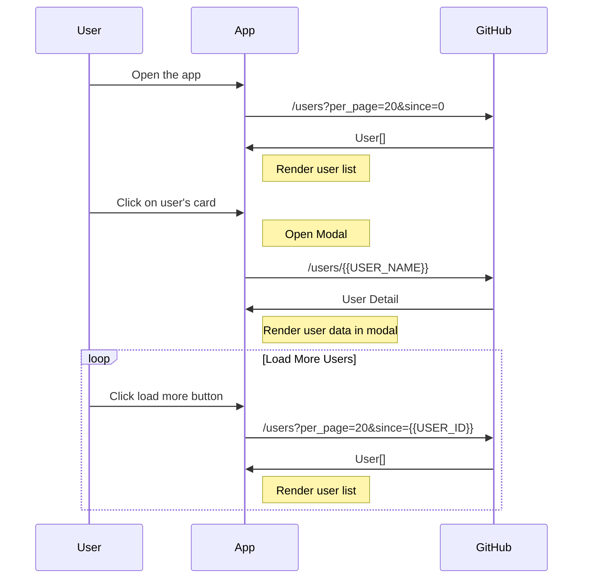

# GitHub User List
## Get Started
- `yarn` to install all the packages
- `yarn dev` to start dev server
## Components
### `<Avatar/>`
- Usage
    - Display the user's avatar image
- Props
    - `url: string` Avatar's url, correspond to GitHub User API's `avatar_url`
    - `alt: string` Alt text, just to keep the minimum a11y
### `<Badge/>`
- Usage
    - To display a tiny dot(badge) on it's child element
- Props
    - `title: string (optional)` A plain old html `title` attribute
    - `color: string (optional)` Badge's color
    - `show: boolean (optional)` Boolean value, to toggle badge's visibility
### `<Card/>`
- Usage
    - Just for styling a bordered card component with white background etc.
- Props
    - Extends all the normal `Div` element's props
### `<Modal/>`
- Usage
    - To open a portal and display user's information. I didn't bother to separate the content inside the modal, since it's a small app, and coupling is expected to decrease overhead.
- Props
    - `open: boolean` A flag to render or remove the modal
    - `userName: string (optional)` Prop to fetching the corresponding User's data
    - `onClose: Function` A function to be called when clicking on `close` button or the backdrop area
## Flow

- **User** open the **App**
- **App** send a request to **GitHub** via `/users?per_page=20&since=0` to get the initial 20 users' data
- **App** recieves the users data from **GitHub**, parse the `Link` header's `next` page url, and store the `since` id as `nextSince` for future uses. And finally render the first 20 users with `<Card/>` component
- When **User** clicked on one of the `<Card/>`, open the `<Modal/>` component, and uses the selected `<Card/>`'s user's `login` name as search param for `/users/{{USER_NAME}}`
- After recieve the user's information from **GitHub**, render the detail in the `<Modal/>`
- When **User** clicked on the `Load More` button, send another request with the lastPage's `nextSince` to **GitHub** for more users data.

## Stack of Choice
- `TypeScript` - For a extra layer of type-safety in development
- `React` - Requirement
- `React-Query` - I decide to not use any state management tool to handle the data from API, because I believe the data should be seperate from app state. A data cache solution should be a better fit for the job.

## Afterthought
I never really use the `Link` header for fetching next page's data. And I found it quite interesting, bacause it seems like it's the the best practice for `REST` API.

But also I found it not really easy to use in the client-side application. To parse the data is not an easy job, and the `parse-link-header` package from `npm` doesn't work nicely in a lot  of browsers. So I decide to ditch it, and parse the header by myself.

In the end of the day, I found the `Link` header is not really necessary for my need, since I'm implementing an infinite list, I don't really need to known the relation between the current response and the `prev` page, all I need to know is the `next`'s `since` ID, which is just the last `user` item in the response. But still, the `Link` header could come in handy when I hit the `last` one I guess?

I'm not really sure what is `site_admin (badge)` in the requirement. So I decide to make a small dot indicator as `<Badge/>` which I believe is the most common component that uses the name `Badge` in other popular component libraries.

## Demo
